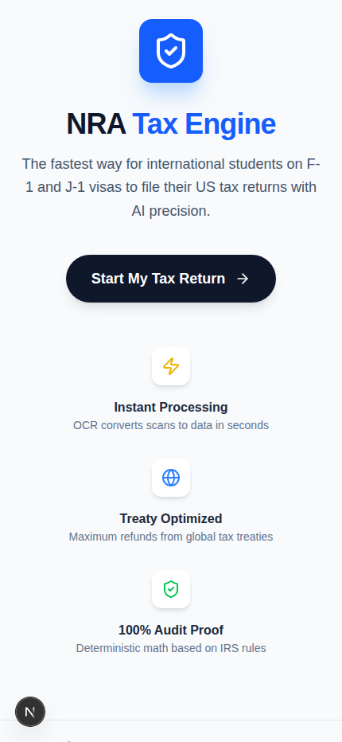
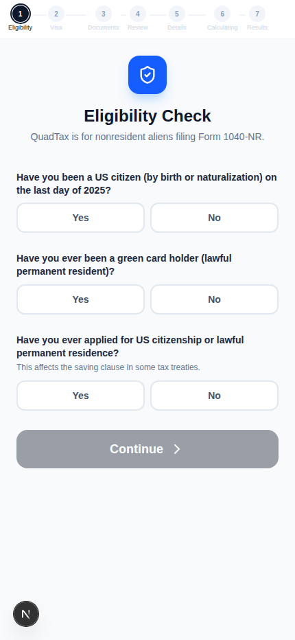
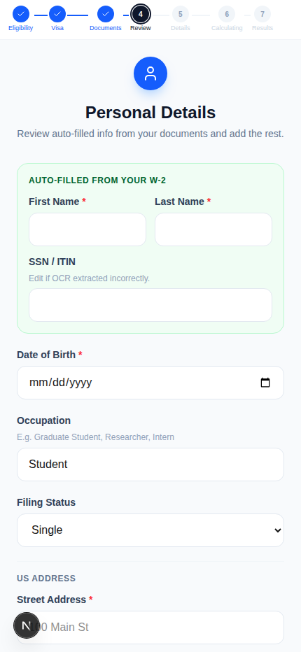
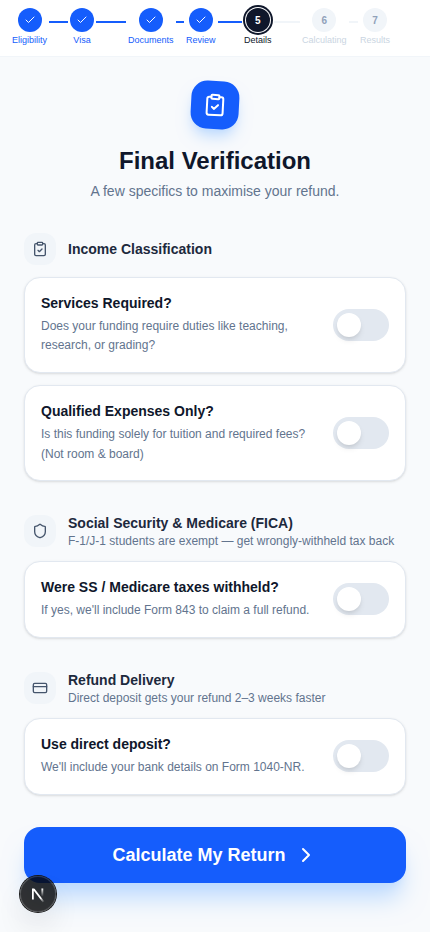

# QuadTax 🚀

A production tax-preparation engine for **Nonresident Alien (NRA)** international students and scholars (F-1 / J-1 / M-1 / Q-1 visas). QuadTax pairs a guided, document-first web intake with a deterministic-centric reasoning engine that produces mail-ready, IRS- and New-York-compliant return packets.

> **Design principle:** LLMs do exactly two things — read printed boxes off uploaded documents and classify free-text income descriptions into a closed enum. **Every dollar, tax bracket, treaty rate, and statutory citation is deterministic Python that a CPA can audit.**

## 📂 Repository Structure

| Component | Path | Description | Tech Stack |
|-----------|------|-------------|------------|
| **Client** | [`nra-tax-client/`](./nra-tax-client) | 7-step guided wizard (Eligibility → Visa → Documents → Review → Details → Calculating → Results) with OCR auto-fill. Types are codegen'd from the engine's OpenAPI schema (no Pydantic↔TS drift). | Next.js 16, TypeScript, Tailwind, Zustand |
| **Engine** | [`nra-tax-engine/`](./nra-tax-engine) | 9-layer orchestrated pipeline: residency, income, treaty, tax, credits, FICA, NY, plus AMT/ITIN/penalty add-ons and form assembly. | Python 3.11+, Pydantic, FastAPI, LLM agents |

---

## 📸 Screenshots

| Home | Eligibility | Visa & Travel |
|---|---|---|
|  |  |  |

| Document upload (OCR) | Auto-filled review | Final verification |
|---|---|---|
|  |  |  |

The wizard is **document-first**: the filer uploads their I-94 / W-2 / 1042-S / 1099 on step 3, `POST /api/v1/ocr` extracts every box value via OCR + a structured-output LLM call, and step 4 pre-fills the form for the filer to confirm rather than retype (see "Auto-filled review" above, sourced from the uploaded W-2).

---

## 🛠 What the engine does

### Residency & exemption (Layer 1)
- Substantial Presence Test (IRC §7701(b)) with the 5-year F/J/M/Q exempt-individual rule and dual-status (arrival/departure-year) detection.

### Document intake & OCR (`POST /api/v1/ocr`)
- `DocumentExtractor` runs `pdfplumber`/OCR text extraction, then an LLM structured-output call per document, returning typed `I94Extracted` / `W2Extracted` / `Form1042SExtracted` / `Form1099Extracted` records the client uses to pre-fill the intake wizard.

### Income classification (Layer 3)
- LLM extracts typed W-2 / 1042-S / 1099 box values (structured output, `temperature=0`).
- Deterministic 1042-S income-code mapper routes ECI vs. FDAP vs. §117-excluded.
- Withholding reconciler aggregates federal / state / FICA across every source.

### Treaty evaluation (Layer 4)
- **66 treaty countries**, every one **verified against IRS Publication 901** (Tables 2 & 3).
- Multi-article support (e.g. China Art 19 + 20(b) + 20(c)), dollar/year caps, US- vs. foreign-source restrictions, saving-clause exceptions, and per-article Form 8833 triggers.
- Country-specific edge cases encoded: China $5k student-wage cap, **India Art 21(2) standard-deduction equivalent**, Germany $9k/4-yr cap, UK foreign-source-only, USSR-successor Article VI, and Hungary/Russia treaty termination/suspension.

### Tax math (Layers 6–8)
- Year-keyed TY2025 graduated brackets (single / MFS / QSS), NRA standard-deduction rules, AMT (Form 6251), Additional Medicare, and the FICA refund path (Form 843) for wrongly-withheld Social Security / Medicare.

### New York (Layer 9)
- IT-203 nonresident / part-year pipeline with NY's own residency test (the *Knight* dorm-exclusion rule), NY-source income allocation, and the federal-treaty add-back per NY Pub 88 (NY does **not** honor federal treaties).

### Forms & output
- Field-map populators for **1040-NR + Schedules OI/NEC/A, 8843, 8833, 843, W-7, 6251, 2210, IT-203 / IT-203-B / IT-203-D**.
- Mailing packager assembles packets in IRS Pub 519 Ch 8 order with cover sheets and the correct IRS / NY DTF service-center addresses (federal, NY, and FICA-843 mailed separately).

### Reliability
- Per-layer audit log (who changed what and why), post-layer reasonability validators, optional dual-extraction confidence check on the LLM, and a human-in-loop review gate that blocks assembly on suspicious numbers.
- `GET /api/v1/packet` validates requested paths with `os.path.commonpath` (not a naive string-prefix check) so a generated packet can only be served from inside `outputs/`.

---

## 🚀 Getting Started

### Backend (engine)
```bash
cd nra-tax-engine
python3.11 -m venv .venv && source .venv/bin/activate
pip install -e ".[dev]"
cp .env.example .env            # set OPENAI_API_KEY for live OCR/classification

pytest -q                               # 324 tests
python -m scripts.audit_treaties        # treaty DB status (66/66 verified)
python -m scripts.qa_end_to_end         # full traced sample return (no API key needed)

uvicorn src.api.main:app --reload --port 8000   # run the API (client expects it on :8000)
```

**API surface** (`http://localhost:8000`): `GET /api/v1/healthz`, `POST /api/v1/ocr` (document extraction), `POST /api/v1/submit` (typed intake → full return), `GET /api/v1/packet` (download a generated packet), `GET /openapi.json` (schema — see `npm run sync-api` below).

### CLI (generate a return packet)
```bash
python -m src.cli generate --intake-json sample_intake.json --output packet/
```

### Frontend (client)
```bash
cd nra-tax-client
npm install
npm run sync-api      # regenerate TS types from the engine's OpenAPI schema
npm run dev           # http://localhost:3000
```

---

## ✅ Test & verification status

- **324 automated tests**, **95%+ line coverage** on the deterministic core (`src/functions` + `src/orchestrator`), including the OCR extraction layer (`DocumentExtractor`, `/api/v1/ocr`).
- **12 golden fixtures** with hand-computed expected outputs (China 20(c), India 21(2), Korea/Germany/UK caps, China year-6 saving-clause, no-treaty H-1B, NY dorm vs. statutory resident, Pakistan + bank interest, zero-income 8843-only).
- **Hypothesis property tests**: accounting identity, bracket monotonicity, treaty-exempt ≤ gross.
- **Client ↔ engine contract**: `npm run sync-api` regenerates `openapi.json` + `src/lib/api-types.ts` straight from the live FastAPI schema — no hand-maintained duplicate types. `npx tsc --noEmit` and `next build` both pass clean.
- Worked example — Indian F-1 at a NY university, $28,000 wages: $15,000 India standard deduction → $13,000 taxable → **$1,322 federal tax**, $2,878 federal refund + $2,142 FICA refund + $115 NY refund.

### Known limitations

- **IRS PDF templates aren't vendored** (`nra-tax-engine/assets/templates/2025/` is absent). This session's outbound network policy blocks `irs.gov`, so the forms can't be auto-downloaded here — the engine gracefully falls back to structured JSON field-maps (every line computed and populated, just not flattened into the official PDF). Drop the year's fillable PDFs (`f1040nr.pdf`, `f1040nro.pdf`/`f1040nra.pdf`/`f1040nrn.pdf` for the schedules, `f8843.pdf`, `f8833.pdf`, `f843.pdf`, `fw7.pdf`, `f6251.pdf`, `f2210.pdf`, `f8316.pdf`) into that directory to switch on real PDF output.
- Some UI copy in the intake wizard references tax year 2025 defaults; always confirm against the current IRS Pub 901 tables before filing.

---

## 🏗 Architecture (how a return flows)

```
Client wizard: Eligibility → Visa → Documents
   ▼
POST /api/v1/ocr  (pdfplumber → raw text → LLM structured output, temperature=0)
   ▼
Client wizard: Review (auto-filled) → Details → Calculating
   ▼
Intake (typed IntakePayload)
   │   MCQRouter projects intake → ReturnStateObject
   ▼
Deterministic DAG  L1 → L3 → L4 → L6 → L7 → L8 → L9
   │   (each layer: mutate state, write audit entry, run validator)
   ▼
Add-ons (AMT, ITIN/W-7, Form 2210)  →  human-in-loop review gate
   ▼
Form field-maps → mailing packager (federal / NY / 843 packets + cover sheets)
   ▼
Client wizard: Results  ←  GET /api/v1/packet
```

---

## ⚖️ Disclaimer

*QuadTax is an automated tool intended to assist in tax preparation. It is not a substitute for professional tax advice from a CPA or qualified tax attorney. Treaty data is verified against IRS Pub 901 but should be independently confirmed before filing.*
