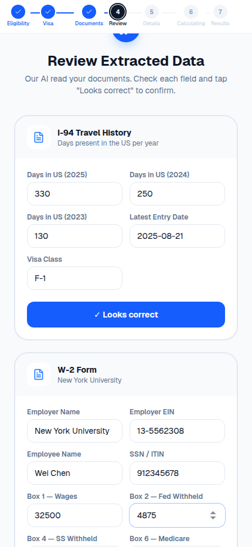
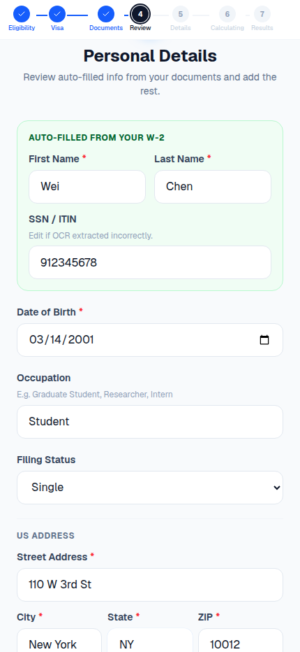
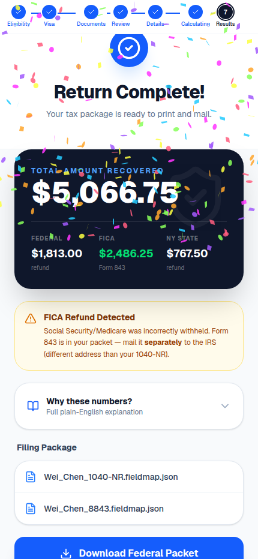

# QuadTax 🚀

A production tax-preparation platform for **Nonresident Alien (NRA)** international students and scholars (F-1 / J-1 / M-1 / Q-1 visas). QuadTax pairs a document-first web wizard with a deterministic-centric reasoning engine that produces mail-ready, IRS- and New-York-compliant return packets.

> **Design principle:** LLMs do exactly two things — read printed boxes off uploaded documents and classify free-text income descriptions into a closed enum. **Every dollar, tax bracket, treaty rate, and statutory citation is deterministic Python that a CPA can audit.**


## 📂 Repository Structure

| Component | Path | Description | Tech Stack |
|-----------|------|-------------|------------|
| **Client** | [`nra-tax-client/`](./nra-tax-client) | Marketing site (testimonials, comparison table, blog, FAQ) + 7-step wizard (Eligibility → Visa → Documents → Review → Details → Calculating → Results) with OCR auto-fill. Types codegen'd from the engine's OpenAPI schema. | Next.js 16, TypeScript, Tailwind v4, Zustand |
| **Engine** | [`nra-tax-engine/`](./nra-tax-engine) | 9-layer orchestrated pipeline: residency, income, treaty, tax, credits, FICA, NY — plus AMT/ITIN/penalty add-ons and form assembly. | Python 3.11+, Pydantic, FastAPI, LLM agents |

---

## 📸 The user journey — type less, confirm more

The wizard is **document-first**: photographs replace typing. Every box value is extracted by OCR + a structured-output LLM, shown back for confirmation, and editable if the scan missed anything.

| 1 · Upload documents | 2 · Review extraction (editable) | 3 · Personal details — pre-filled | 4 · Results |
|---|---|---|---|
|  |  |  |  |

In screenshot 3 the name **Wei Chen** and ITIN were never typed — they came off the uploaded W-2. The results screen shows the worked test scenario: **$1,813 federal + $2,486 FICA + $767 NY = $5,066.75 recovered**, with the Form 843 separate-mailing warning surfaced automatically.

---

## 🛠 What the engine does

### Document intake & OCR (`POST /api/v1/ocr`)
- `DocumentExtractor` runs `pdfplumber`/OCR text extraction, then an LLM structured-output call per document, returning typed `I94Extracted` / `W2Extracted` / `Form1042SExtracted` / `Form1099Extracted` records that pre-fill the wizard.

### Residency & exemption (Layer 1)
- Substantial Presence Test (IRC §7701(b)) with the 5-year F/J/M/Q exempt-individual rule and dual-status (arrival/departure-year) detection.

### Income classification (Layer 3)
- Deterministic 1042-S income-code mapper routes ECI vs. FDAP vs. §117-excluded.
- Withholding reconciler aggregates federal / state / FICA across every source.

### Treaty evaluation (Layer 4)
- **66 treaty countries**, every one **verified against IRS Publication 901** (Tables 2 & 3).
- Multi-article support (e.g. China Art 19 + 20(b) + 20(c)), dollar/year caps, US- vs. foreign-source restrictions, saving-clause exceptions, per-article Form 8833 triggers.
- Edge cases encoded: China $5k student-wage cap, **India Art 21(2) standard-deduction equivalent**, Germany $9k/4-yr cap, UK foreign-source-only, USSR-successor Article VI, Hungary/Russia treaty termination/suspension.

### Tax math (Layers 6–8)
- Year-keyed TY2025 graduated brackets (single / MFS / QSS), NRA standard-deduction rules, AMT (Form 6251), Additional Medicare, and the FICA refund path (Form 843) for wrongly-withheld Social Security / Medicare.

### New York (Layer 9)
- IT-203 nonresident / part-year pipeline with NY's own residency test (the *Knight* dorm-exclusion rule), NY-source income allocation, and the federal-treaty add-back per NY Pub 88 (NY does **not** honor federal treaties).

### Forms & output
- Field-map populators for **1040-NR + Schedules OI/NEC/A, 8843, 8833, 843, W-7, 6251, 2210, IT-203 / IT-203-B / IT-203-D**.
- Mailing packager assembles packets in IRS Pub 519 Ch 8 order with cover sheets and the correct IRS / NY DTF service-center addresses (federal, NY, and FICA-843 mailed separately).

### Reliability
- Per-layer audit log, post-layer reasonability validators, optional dual-extraction confidence check, and a human-in-loop review gate that blocks assembly on suspicious numbers.
- `GET /api/v1/packet` validates paths with `os.path.commonpath` so packets can only be served from `outputs/`.

---

## 🔌 API connection guide — what to plug in for real end-to-end results

The prototype runs end-to-end with **one external dependency: an OpenAI API key**. Everything else is deterministic and self-contained.

### 1. The one required key

```bash
cd nra-tax-engine
cp .env.example .env
# Set inside .env:
#   OPENAI_API_KEY=sk-...        ← powers OCR field extraction + income classification
```

The engine calls the OpenAI **Chat Completions structured-output API** (`gpt-4o-2024-08-06`, `temperature=0`) in exactly two places:
`src/intake/document_extractor.py` (read boxes off W-2 / 1042-S / 1099 / I-94) and `src/agents/l4_treaty.py` (classify the income description into a closed treaty-category enum). No key = the wizard's "Scan All Documents" step fails; **every other layer works without it**.

### 2. Start both servers

```bash
# Terminal 1 — engine API on :8000
cd nra-tax-engine && uvicorn src.api.main:app --reload --port 8000

# Terminal 2 — web client on :3000
cd nra-tax-client && npm install && npm run dev
```

The client reads `NEXT_PUBLIC_API_BASE_URL` (defaults to `http://localhost:8000/api/v1`) — set it if the engine runs elsewhere.

### 3. The four endpoints the client uses

| Endpoint | When it fires | What it does |
|---|---|---|
| `POST /api/v1/ocr` | "Scan All Documents" | OCR + LLM extraction → typed `OcrResult` that pre-fills the wizard |
| `POST /api/v1/submit` | "Calculate My Return" | Runs the full L1→L9 deterministic pipeline; returns refunds, forms, packet paths |
| `GET /api/v1/packet?path=…` | "Download Packet" | Serves a generated packet file from `outputs/` |
| `GET /api/v1/healthz` | monitoring | liveness probe |

Contract sync: `cd nra-tax-client && npm run sync-api` regenerates `openapi.json` + `src/lib/api-types.ts` from the live FastAPI schema — never hand-edit the types.

### 4. Optional connections (production hardening)

| Integration | Purpose | Where |
|---|---|---|
| Second LLM key (dual-extract) | Cross-check numeric OCR fields; mismatch → human review | `QUADTAX_DUAL_EXTRACT=true` env (`src/agents/_llm_safety.py`) |
| Tesseract binary | OCR fallback for photographed (non-PDF) documents | `apt install tesseract-ocr` — auto-detected by `ocr_parser.py` |
| IRS PDF templates | Real filled PDFs instead of JSON field-maps | Drop fillable PDFs in `nra-tax-engine/assets/templates/2025/` (list in Known limitations) |
| Audit-log persistence | Per-filing JSONL decision trace | `QUADTAX_AUDIT_DIR=/var/log/quadtax` env |

---

## ✅ Test & verification status

- **324 automated engine tests**, 95%+ line coverage on the deterministic core, including the OCR extraction layer.
- **12 golden fixtures** with hand-computed expected outputs (China 20(c), India 21(2), Korea/Germany/UK caps, China year-6 saving-clause, no-treaty H-1B, NY dorm vs. statutory resident, Pakistan + bank interest, zero-income 8843-only).
- **Hypothesis property tests**: accounting identity, bracket monotonicity, treaty-exempt ≤ gross.
- **Browser E2E (Playwright)**: the full 7-step wizard driven headlessly — upload → OCR pre-fill verified field-by-field (`Wei`/`Chen`/ITIN from the W-2) → edited value round-trip → results asserting $1,813 federal and $2,486 FICA render. Zero console or page errors.
- **`next build` clean**: 17 static routes, no prerender errors (a long-standing `location is not defined` crash in the OCR-review page was found and fixed during the audit — `router.push` during render moved into an effect).
- `npx tsc --noEmit` clean; client↔engine contract regenerated from the live OpenAPI schema.

### Known limitations

- **IRS PDF templates aren't vendored** (`nra-tax-engine/assets/templates/2025/` is absent — the dev environment's network policy blocks irs.gov). The engine falls back to structured JSON field-maps: every line computed and populated, just not flattened into the official PDF. Drop the year's fillable PDFs (`f1040nr.pdf`, `f1040nro/a/n.pdf`, `f8843.pdf`, `f8833.pdf`, `f843.pdf`, `fw7.pdf`, `f6251.pdf`, `f2210.pdf`, `f8316.pdf`) into that directory to switch on real PDF output.
- Landing-page testimonials are illustrative personas drawn from the verified golden-fixture suite (labeled as such on the page).

---

## 🏗 Architecture (how a return flows)

```
Client wizard: Eligibility → Visa → Documents
   ▼
POST /api/v1/ocr  (pdfplumber → raw text → LLM structured output, temperature=0)
   ▼
Client wizard: Review (auto-filled, editable) → Personal (pre-filled) → Details
   ▼
POST /api/v1/submit  (typed IntakePayload)
   │   MCQRouter projects intake → ReturnStateObject
   ▼
Deterministic DAG  L1 → L3 → L4 → L6 → L7 → L8 → L9
   │   (each layer: mutate state, write audit entry, run validator)
   ▼
Add-ons (AMT, ITIN/W-7, Form 2210)  →  human-in-loop review gate
   ▼
Form field-maps → mailing packager (federal / NY / 843 packets + cover sheets)
   ▼
Client wizard: Results  ←  GET /api/v1/packet
```

---

## 🚀 Getting Started

### Backend (engine)
```bash
cd nra-tax-engine
python3.11 -m venv .venv && source .venv/bin/activate
pip install -e ".[dev]"
cp .env.example .env                    # set OPENAI_API_KEY

pytest -q                               # 324 tests
python -m scripts.audit_treaties        # treaty DB status (66/66 verified)
python -m scripts.qa_end_to_end         # full traced sample return (no API key needed)
uvicorn src.api.main:app --reload --port 8000
```

### Frontend (client)
```bash
cd nra-tax-client
npm install
npm run sync-api      # regenerate TS types from the engine's OpenAPI schema
npm run dev           # http://localhost:3000
```

---

## ⚖️ Disclaimer

*QuadTax is an automated tool intended to assist in tax preparation. It is not a substitute for professional tax advice from a CPA or qualified tax attorney. Treaty data is verified against IRS Pub 901 but should be independently confirmed before filing.*
